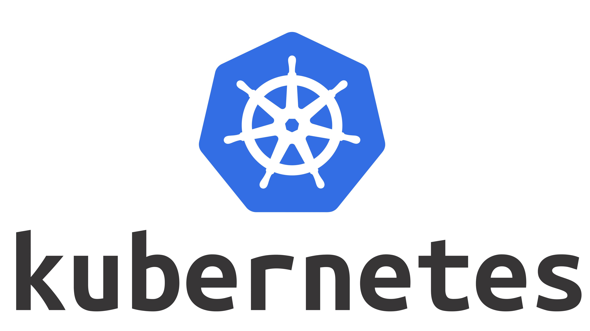
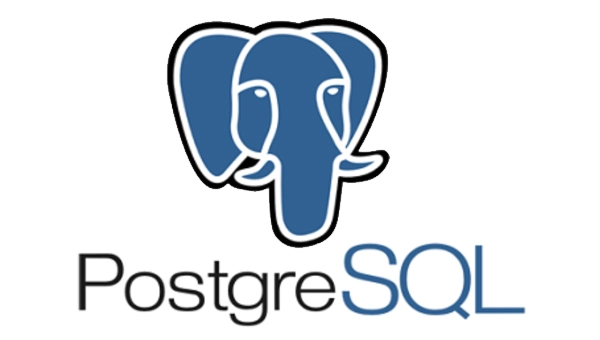

<a name="readme-top"></a>
<!--

-->


<!-- PROJECT SHIELDS -->
<!--
-->


<!-- PROJECT LOGO -->
<br />
<div align="right">
  <a href="https://github.com/temi109/formula1_elt.git">
    
  </a>

<h3 align="center">Formula 1 Data ETL/ELT Pipeline</h3>

  <p align="center">
    This project utilises modern data stack etl/elt technologies such as Terraform, DBT and Snowflake, to ingest, transform and deploy real-word formula 1 data from a source postgres database to a full fledged snowflake datawarehouses, in which data can be further transformed to meet end-users needs (with DBT)
    <br />
    <a href="https://github.com/formula1elt"><strong>Explore the docs »</strong></a>
    <br />
  </p>
</div>

<!-- PROJECT SHIELDS -->


<!-- TABLE OF CONTENTS -->
<details>
  <summary>Table of Contents</summary>
  <ol>
    <li>
      <a href="#about-the-project">About The Project</a>
      <ul>
        <li><a href="#built-with">Built With</a></li>
      </ul>
    </li>
    <li>
      <a href="#getting-started">Getting Started</a>
      <ul>
        <li><a href="#prerequisites">Prerequisites</a></li>
        <li><a href="#installation">Installation</a></li>
      </ul>
    </li>
    <li><a href="#usage">Usage</a></li>
    <li><a href="#roadmap">Roadmap</a></li>
    <li><a href="#contributing">Contributing</a></li>
    <li><a href="#license">License</a></li>
    <li><a href="#contact">Contact</a></li>
  </ol>
</details>


<!-- ABOUT THE PROJECT -->
## About The Project
This project uses data downloaded from the ergast api documentation: http://ergast.com/mrd/.
The API provides data for the Formula One series, from the beginning of the world championships in 1950. I have downloaded four database tables containing these results i.e the Circuits, Races, Constructors and Results tables, and have stored the tables within four respective schemas of a postgres database hosted by Airflow.
The aim of this project is to extract the data from these source postrges tables, load the corresponding files to an S3 datalake (using Airflow), further extract to a snowflake database staging area (using Airflow) and finally to the data warehouse layer of the snowflake database where DBT will be utilised to carry out necessary transformations. Terraform will be used to provision required resources for the project, such as IAM roles and S3 buckets.


### Built With


<p align="left">
  
 &nbsp; </code> </code>  &nbsp; </code>  &nbsp; </code>   &nbsp; </code>  &nbsp;</code> </code> &nbsp; </code> 


<!-- GETTING STARTED -->

### Prerequisites

* Postgres Database
* AWS Account
* Terraform installed
* DBT installed
* Snowflake Integration Object with s3 configured

#### Required for KinD Cluster:

- Kubectl
- Helm
- Docker
- KinD


To initialise terraform and create the s3 bucket, run the following commands:

```sh

  terraform init  
  
  terraform validate

  terraform plan

  terraform apply

  ```


<p align="right">(<a href="#readme-top">back to top</a>)</p>


### Installation

1. Clone the repo
 ```sh
 https://github.com/temi109/formula1_elt.git
 ```
2. Change directories into k8s-airflow folder and create a k8s cluster of 1 control plane and 3 worker nodes
 ```sh
 cd k8s-airflow/

 kind create cluster --name airflow-cluster --config kind-cluster.yaml

 # Add the official repository of the Airflow Helm Chart
 helm repo add apache-airflow https://airflow.apache.org

 # Update the repo
 helm repo update

 # Create namespace airflow
 kubectl create namespace airflow

 # Check the namespace 
 kubectl get namespaces

 # Install the Airflow Helm Chart and start it 
 helm install airflow ./airflow/ --namespace airflow --debug

 # Get pods
 kubectl get pods -n airflow
 ```
3. Build dockerfile and upgrade the cluster
 ```sh

 # (Make sure you're in k8s-airflow folder)
 docker build -t airflow-custom:2.5.1 .

 kind load docker-image airflow-custom:2.5.1 --name airflow-cluster

 cd airflow/

 helm upgrade airflow --values=myvalues.yaml . --namespace airflow --debug

 # Port forward 8080:8080
 kubectl port-forward svc/airflow-webserver 8080:8080 -n airflow --context kind-airflow-cluster

 # Validating server up and running
 Go to browser and type localhost:8080 into browser search, and the username/password admin, admin respectively.

 ```

<p align="right">(<a href="#readme-top">back to top</a>)</p>


<!-- USAGE EXAMPLES -->
## Usage

Once data has been transported into the Snowflake with airflow, dbt is used to transform the data and produce data marts that can be adjusted to the end user's needs

 ```sh
 
 # Change Directories into dbt folder
 cd dbt/
 
 # Run all dbt models
 dbt run
 
 ```


<!-- CONTACT -->
## Contact


Project Link: [https://github.com/temi109/formula1_elt] (https://github.com/temi109/formula1_elt)

<p align="right">(<a href="#readme-top">back to top</a>)</p>

